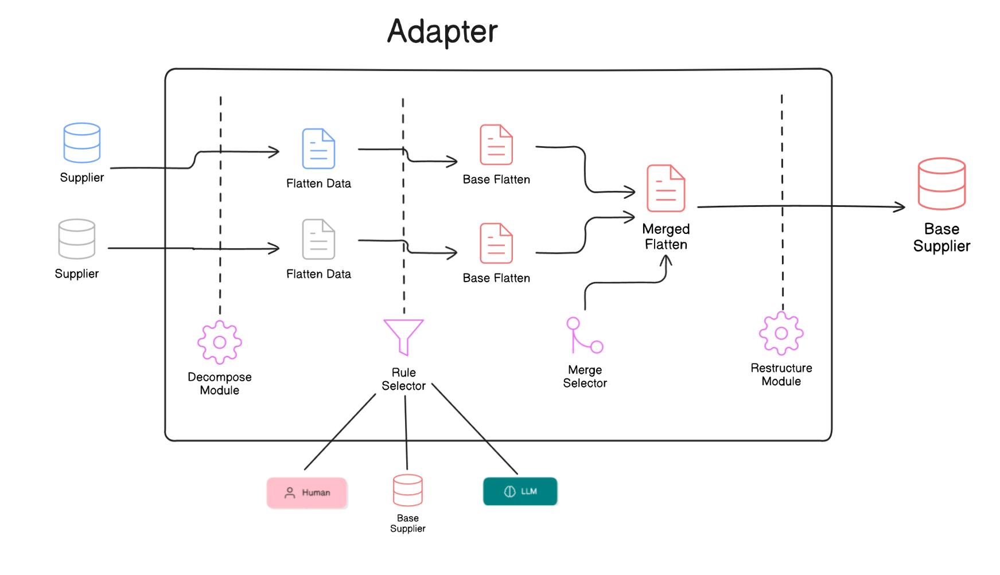

## Some note:
- We acknowledge that the current codebase is not optimized. However, this README aims to clarify the system’s functionality and demonstrate its potential for scalability and improvement in the future.

# System Overview

The system for this assignment is illustrated in the diagram above. Below is a detailed breakdown of its components, functionality, and future improvements.

---

## **Adapter Component**
1. **Decompose Module**  
   - **Implementation:** `Adapter/flattenData()`  
   - **Functionality:**  
     Transforms supplier data into a **Flatten format** (described below) to simplify hierarchical JSON data for easier processing and merging.  
     - **Methodology:**  
       Utilizes a simple **DFS (Depth-First Search)** algorithm to traverse the JSON tree and decompose it into smaller components.

2. **Restructure Module**  
   - **Implementation:** `Adapter/restructuring`  
   - **Functionality:**  
     Converts Flatten data back into the original supplier JSON structure.

3. **Rule Selector**  
   - **Implementation:**  
     `RuleSelector`, with rule configurations stored in the `rules` folder in JSON format. These rules define mappings between different Flatten data types and the base structure.  
   - **Functionality:**  
     Provides utility functions for applying rules or strategies to map between various Flatten data formats.  
   - **Future Work:**  
     The current implementation is basic and not optimized. However, the system is designed for scalability, allowing the integration of advanced strategies, including leveraging LLMs for enhanced rule generation and application.

4. **Merge Selector**  
   - **Functionality:**  
     Provides utility functions to merge Flatten data effectively.  
   - **Future Work:**  
     Similar to the Rule Selector, this component is designed for scalability and can accommodate more optimized strategies in future iterations.

---

## **Flatten Format**
The **Flatten format** transforms hierarchical JSON data into a simplified, flat structure, making it easier to process and merge. This format deconstructs nested dictionaries, lists, and scalar values into key-value pairs.

### **Example Transformation**
#### Example Supplier JSON Structure:
```json
{
  "amenities": {
    "general": ["outdoor pool", "indoor pool"],
    "room": ["aircon", "tv"]
  }
}
```

#### Example Flatten Structure
```
{
  "amenities.general.#id": "outdoor pool",
  "amenities.general.#id": "indoor pool",
  "amenities.room.#id": "aircon",
  "amenities.room.#id": "tv"
}
```

## Rule Generator
We also have a rule generator code for generate some pattern for Rule Selector.
- We can modify by hand (humand) or use LLM Api for support us generate some pattern rule with the high accuracy.


